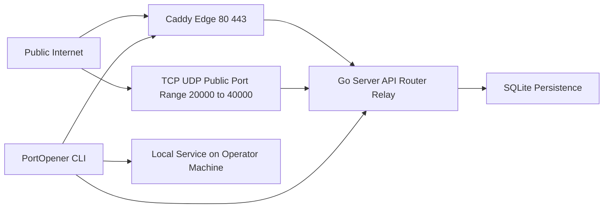
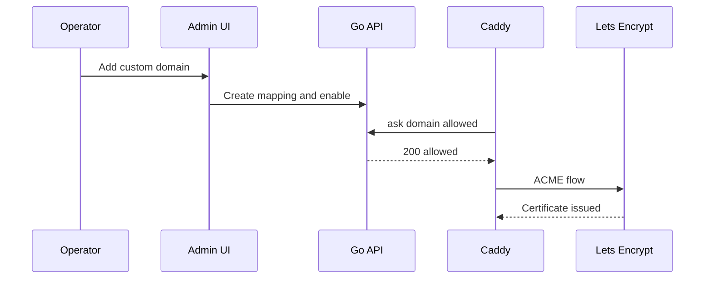

# PortOpener Planning Package

Authoritative scope source: [`docs/chat.md`](../docs/chat.md)

This planning package is intended to be **implementation-ready** while remaining aligned to the non-negotiables in [`docs/chat.md`](../docs/chat.md).

Status: Draft v0.2 (scope-aligned)

## Resolved gaps (explicit decisions)

These previously-open decisions are now treated as constraints for design and roadmap:

- **CLI OS targets**: Windows, Linux (Ubuntu/Debian compatible; multi-tunnel + daemon/background mode)
- **VPS deployment style**: Docker Compose (UK VPS)
- **Retention**: access logs 14 days; metrics rollups 60 days

---

## Executive Summary

PortOpener is a **personal-use tunneling system** (not a multi-tenant SaaS) that exposes local services to the internet through a UK VPS “edge”. It replicates the core feature set described in [`docs/chat.md`](../docs/chat.md):

- Public HTTPS URLs exposing local services
- HTTP(S) including WebSockets, plus TCP and UDP tunnels
- Static subdomains and reserved external ports
- Custom domains with automatic TLS via Let’s Encrypt
- Per-tunnel IP allowlists
- Token rotation
- Persistence for reservations and mappings
- Access logs and basic metrics
- One CLI process running multiple tunnels; daemon/background mode
- Minimal web UI for management

### Key decisions captured in this plan

- **Implementation stack**: Go for server + CLI; minimal web UI served as static assets by the Go server.
- **Edge/TLS**: Caddy terminates TLS on the VPS and routes by Host header. DNS provider is Cloudflare; ACME will use DNS-01 (via a Caddy DNS plugin) where needed.
- **Custom domains**: Caddy **on-demand TLS** gated by an `ask` endpoint so certificates only issue for domains explicitly mapped in the admin UI.
- **Deployment**: Docker Compose on the VPS.
- **Networking**: TCP+UDP port range `20000–40000` inbound for public port tunnels; `80/443` inbound for HTTP(S).
- **Admin security**: token auth plus an **admin IP allowlist**.

### Scope compliance checklist

The plan explicitly covers all non-negotiables in [`docs/chat.md`](../docs/chat.md):

- Protocols: HTTP(S)+WebSockets, TCP, UDP
- Addressing: static subdomains under `tunnel.<base-domain>`, reserved TCP/UDP ports in `20000–40000`
- Custom domains: automatic TLS (Let’s Encrypt), no “manual reverse proxy in front” mode
- Security: per-tunnel IP allowlist, token rotation
- Persistence: survives restarts (SQLite)
- Observability: access logs + basic metrics (bytes + requests/connections)
- Client UX: multi-tunnel CLI + daemon/background mode
- Admin surface: minimal web UI for management

### Outcomes

This planning package proposes:

- A pragmatic, VPS-friendly architecture (Caddy + Go) supporting long-lived connections and arbitrary TCP/UDP listeners.
- A milestone-driven roadmap aligned to the build order in [`docs/chat.md`](../docs/chat.md).
- An operational baseline (Docker Compose, firewall expectations, basic observability).
- A draft `AGENTS.md` workflow to standardize development conventions.

---

## Project Charter

### Vision

Provide a reliable personal tunnel “edge” that can safely expose local services (HTTP(S)/TCP/UDP) through stable public addresses (static subdomains and reserved ports), with minimal ongoing ops and a small admin surface.

### Problem statement

Current tooling either targets SaaS/team use-cases, lacks UDP, or complicates custom domain TLS. PortOpener will deliver the core Port Buddy-like experience for a **single operator** on a UK VPS, with persistence, logging, and a minimal admin UI.

### Scope

#### In scope (non-negotiable)

From [`docs/chat.md`](../docs/chat.md):

- HTTP(S) tunnels (incl. WebSockets)
- TCP tunnels
- UDP tunnels
- Static subdomain reservations under `tunnel.<base-domain>`
- Reserved external port allocations for TCP and UDP
- Custom domains with automatic TLS via Let’s Encrypt (no “bring your own TLS termination” mode)
- Per-tunnel IP allowlist
- Token rotation
- Persistence across restarts
- Access logs and basic metrics
- CLI multi-tunnel + daemon/background mode
- Minimal web UI: list/kill tunnels, manage reservations/domains, rotate token, view logs + metrics

#### Out of scope (initially)

- Teams, accounts, multi-tenant SaaS features
- Config profiles
- Mandatory passcode-protected tunnels (explicitly optional)
- High-cardinality analytics, SIEM integration, or advanced tracing

### Stakeholders

- Primary: single operator (you)
- Secondary: none (no public multi-user requirements)

### Success criteria (definition of done)

- A tunnel can be created and remains stable across reconnects and server restarts.
- A static subdomain can be reserved and consistently routes to the correct tunnel.
- A TCP/UDP external port can be reserved and forwards reliably.
- A custom domain can be mapped and receives valid TLS automatically without issuing certs for unapproved domains.
- Admin UI can view/kill tunnels, manage reservations/domains, rotate token.
- Logs and basic metrics are captured and queryable for the configured retention.

### Constraints and assumptions

- VPS in UK (OVH UK) with public IPv4 and open inbound port range.
- Cloudflare manages the base domain DNS; using DNS APIs is acceptable.
- Docker Compose is acceptable on the VPS.
- Single-user token auth; admin access is further restricted by IP allowlist.

---

## Technical Architecture Proposal

### High-level architecture

**Caddy** is the public edge for HTTP(S), responsible for:

- TLS termination for `*.tunnel.<base-domain>` and `admin.tunnel.<base-domain>`
- On-demand TLS for custom domains gated by an `ask` endpoint
- Reverse proxy routing to the Go server based on Host

**Go server** handles:

- Control plane: auth, tunnel lifecycle, reservations, domain mappings, token rotation
- Data plane: multiplexed relay connections from CLI clients
- Public TCP/UDP listeners for reserved ports (direct binds)
- Persistence and observability (SQLite, logs, metrics rollups)
- Serving the static admin UI assets

**CLI** runs on Windows/macOS/Linux, responsible for:

- Authenticating with the server using the operator token
- Establishing persistent relay connection(s)
- Managing multiple tunnels concurrently in one process
- Daemon/background mode (service installation + run loop)

CLI OS targets:

- Windows
- Linux (Ubuntu/Debian compatible)

### Component diagram (conceptual)

### Data plane transport

A single CLI instance must support **multiple tunnels** concurrently. The recommended approach is:

- CLI establishes a persistent connection to the server (over HTTPS via Caddy, using WebSocket).
- The WebSocket is wrapped as a stream transport and multiplexed (e.g., using a stream multiplexer).
- Each tunnel and each proxied connection/request uses logical streams over the multiplexed session.

This enables:

- HTTP request/response forwarding, including WebSocket upgrades
- TCP bidirectional byte streams
- UDP datagram framing over a reliable stream (with per-peer session mapping)

### HTTP(S) tunnel request flow

1. Public request hits `https://<subdomain>.tunnel.<base-domain>` or `https://<custom-domain>`.
2. Caddy terminates TLS and reverse proxies to the Go server HTTP router.
3. Go router looks up the destination tunnel session for that host.
4. Go server forwards the request to the CLI over a logical stream.
5. CLI dials the local service and returns the response.

WebSockets:

- HTTP upgrade requests are tunneled as long-lived bidirectional streams with backpressure.

### TCP tunnel flow

1. Public TCP connection arrives on reserved external port in `20000–40000`.
2. Go server accepts the connection on that port.
3. Go server opens a logical stream to the CLI tunnel session.
4. CLI dials local TCP target and pipes bytes both directions.

### UDP tunnel flow

UDP requires explicit session mapping:

- On server: map `{tunnel_id, remote_addr}` to a session with last-seen timestamp.
- Datagram frames are sent over the relay to the CLI and written to the local UDP socket.
- Reverse direction: responses are framed with the intended remote address.
- Session expiry governs cleanup.

### Custom domains + TLS issuance

Goal: allow `example.com` to map to a tunnel and receive automatic TLS **without** allowing arbitrary certificate issuance.

Design:

- Operator adds a custom domain in the admin UI.
- The Go server stores the mapping and marks it as eligible for TLS.
- Caddy is configured for on-demand TLS for custom domains.
- Caddy calls an `ask` endpoint on the Go server before attempting certificate issuance.
- The `ask` endpoint returns 200 only if the domain is present, verified, and enabled.

Operational note:

- With Cloudflare as DNS provider, ACME can be DNS-01 where appropriate. The on-demand `ask` gate remains the security control for *when* issuance is permitted.

### Persistence model

SQLite is the initial single-node datastore, matching the table suggestions in [`docs/chat.md`](../docs/chat.md). Recommended additions for operational robustness:

- Uniqueness constraints for subdomain and port reservations
- Soft-delete or status fields for tunnels and domain mappings
- Indexes on lookup keys used at request time (hostnames, external_port, tunnel_id)

### Authentication and authorization

- Single operator token stored server-side as a hash.
- CLI uses the token to authenticate and obtain a session.
- Admin UI/API protected by:
  - Token auth (header or cookie with server-side session)
  - Admin IP allowlist (enforced in Go; optionally duplicated in Caddy)

Token rotation:

- UI triggers revoke+issue flow.
- Old token becomes invalid for new sessions; existing sessions may be terminated or allowed to drain based on policy.

### Observability

- Access logs per tunnel.
- Basic metrics: request/connection counts and bytes in/out.
- Retention:
  - Logs retained 14 days
  - Metrics rollups retained 60 days

Implementation notes:

- Prefer writing logs to SQLite (bounded by retention) or to rotating files with a lightweight shipper later.
- Keep metrics rollups coarse (minute buckets) to avoid unbounded growth.

### Deployment and operations

Docker Compose on the VPS runs:

- `caddy` container (ports 80/443)
- `server` container (Go server)
- `sqlite` is a file volume mounted into the server

Networking:

- Recommend `network_mode: host` to simplify binding large TCP/UDP ranges.
- Firewall (host): allow inbound 80/443 and 20000–40000 for both TCP and UDP.

Backups:

- Periodic snapshot of the SQLite database file.
- If using host volumes, ensure correct permissions and backup location.

---

## Development Roadmap (Phased Milestones)

Milestones are ordered to match the build intent in [`docs/chat.md`](../docs/chat.md) while respecting the chosen stack.

### Phase 0 — Repo scaffold, dev workflow, and deploy baseline

Deliverables:

- Go module skeleton for server + CLI
- Docker Compose + baseline Caddy config
- SQLite migrations framework
- Local dev commands and CI basics

Done when:

- `docker compose up` brings up edge + server locally (with self-signed or local dev TLS strategy).
- A “hello” admin UI page is served at `admin.tunnel.<base-domain>` in dev.

### Phase 1 — HTTP tunnels, wildcard subdomains, IP allowlist, logs/metrics (M1)

Deliverables:

- CLI can register an HTTP tunnel and receive a public URL
- Wildcard subdomain routing through Caddy to the correct tunnel
- WebSocket support
- Per-tunnel IP allowlist enforced for HTTP
- Basic request logging + counters

Done when:

- HTTP and WebSocket traffic works end-to-end with allowlist enforcement.

### Phase 2 — Persistence + minimal admin UI (M2)

Deliverables:

- SQLite persistence for subdomain reservations and tunnel metadata
- Admin UI pages for active tunnels, reservations, allowlists, logs/metrics
- Ability to kill active tunnels

Done when:

- Server restart preserves reservations and admin UI can manage them.

### Phase 3 — TCP tunnels + reserved ports (M3)

Deliverables:

- Port allocator for TCP in `20000–40000`
- Reserved port feature and persistence
- Multi-connection support
- Connection logs and byte counters

Done when:

- A reserved TCP port reliably forwards to the local target across reconnects.

### Phase 4 — UDP tunnels + reserved ports (M4)

Deliverables:

- UDP listener and datagram relay
- Session mapping and timeouts
- Datagram/byte metrics

Done when:

- UDP forwarding works for a test service with expected session expiry.

### Phase 5 — Custom domains + automatic TLS (M5)

Deliverables:

- Custom domain mapping UI and persistence
- Caddy on-demand TLS gated by `ask`
- DNS-01 ACME flow via Cloudflare
- UI status and error reporting

Done when:

- A mapped custom domain obtains valid TLS and routes to the tunnel; unmapped domains cannot trigger issuance.

### Phase 6 — Multi-tunnel CLI + daemon mode (M6)

Deliverables:

- One CLI process manages multiple tunnels
- Daemon/background mode on Windows/macOS/Linux
- Auto-reconnect and server cleanup for dropped clients

Done when:

- Operator can start the daemon, confirm tunnels survive network blips, and stop cleanly.

### Phase 7 — Token rotation + hardening (M7)

Deliverables:

- Token rotation API/UI
- Client re-init flow
- Security hardening checklist completed

Done when:

- Old tokens are invalidated as designed and new token is displayed once.

---

## Resource and Risk Assessment

### Personnel and skill needs

For a personal project, this can be built by a single engineer, but the work spans multiple domains:

- Go networking: TCP/UDP relays, backpressure, concurrency
- HTTP proxying semantics: headers, streaming, WebSockets, timeouts
- TLS/ACME ops: Caddy configuration, DNS-01, on-demand TLS safety
- Linux/VPS ops: firewall, Docker Compose, volume backups
- Basic frontend: minimal UI pages and API wiring

Optional support (if you want to accelerate):

- Security review of the on-demand TLS gating and token handling

### Key risks and mitigations

- **On-demand TLS abuse** (unapproved cert issuance)
  - Mitigation: strict `ask` gate; store domain allowlist in SQLite; require explicit enable state; log all `ask` decisions.

- **UDP semantics complexity** (session mapping, NAT, timeouts)
  - Mitigation: define explicit idle timeouts and document limitations; implement bounded session tables; add metrics for session counts.

- **Docker networking complexity** (publishing large port ranges)
  - Mitigation: use host networking on the VPS; document firewall and port ownership.

- **Persistence growth** (logs/metrics blow-up)
  - Mitigation: enforce retention; rollups; indexes; background cleanup jobs.

- **Reliability under reconnect** (half-open streams, stale reservations)
  - Mitigation: heartbeat/lease model for tunnels; server-side cleanup; idempotent registration.

- **Security of admin surface**
  - Mitigation: token auth + IP allowlist; minimal endpoints; CSRF-safe design if using cookies.

---

## Planning suite (document index)

This repository also provides the planning package as a **suite** of standalone documents for easier navigation:

- [`plans/executive-summary.md`](executive-summary.md)
- [`plans/project-charter.md`](project-charter.md)
- [`plans/technical-architecture.md`](technical-architecture.md)
- [`plans/roadmap.md`](roadmap.md)
- [`plans/risk-assessment.md`](risk-assessment.md)

---

## Implementation Plan (dependency-ordered, execution-ready)

This section follows the required planning structure.

### 1. Problem

Build a personal tunnel edge and CLI capable of securely exposing local services over HTTP(S)/TCP/UDP with stable addressing, custom domains with automatic TLS, persistence, and minimal admin management.

### 2. Scope (in / out)

- In: items listed under Charter in-scope.
- Out: teams/multi-tenant SaaS; config profiles; required passcodes.

### 3. Constraints and assumptions

- Go + Caddy + Cloudflare DNS-01.
- Docker Compose deployment.
- Port range `20000–40000` reserved for public TCP/UDP tunnels.
- Admin is token-only plus IP allowlist.

### 4. User flows (happy path + edge cases)

Happy paths:

- CLI init token → start HTTP tunnel → receive URL → public request succeeds.
- Reserve subdomain → start tunnel using reservation → server restart → still routes.
- Reserve TCP/UDP port → public client connects/sends datagrams → forwards.
- Add custom domain → verify/enable → TLS issues → routes.
- Rotate token → CLI re-init.

Edge cases:

- Client disconnect mid-stream; server cleanup.
- Concurrent reservation attempts; uniqueness constraints.
- UDP NAT changes; session expiration.
- Custom domain misconfigured DNS; error surfaced in UI.

### 5. Data changes (if any)

Start with SQLite schema as in [`docs/chat.md`](../docs/chat.md). Add:

- Status enums and timestamps for tunnel sessions
- Uniqueness constraints and indexes
- Retention cleanup tables/jobs

### 6. API/server changes (if any)

Define minimal API surface:

- Auth: init/handshake, token rotation
- Tunnels: register, heartbeat, list, kill
- Reservations: subdomains, ports
- Domains: create, enable/disable, status
- Logs/metrics: query endpoints for UI
- TLS gating: `ask` endpoint for Caddy

### 7. UI changes (if any)

Minimal pages from [`docs/chat.md`](../docs/chat.md): Dashboard, Reservations, Domains, Security, Logs/Metrics.

### 8. Test plan

- Unit tests:
  - Reservation uniqueness and port allocation
  - Token validation and rotation behavior
  - UDP session mapping and expiry
- Integration tests:
  - Bring up Compose, run CLI against local server, validate HTTP and TCP proxy
- E2E smoke path:
  - Start server + edge, start a local demo service, create a tunnel, curl public URL, rotate token, verify old token fails.

### 9. Rollout/rollback

- Rollout:
  - Deploy Compose baseline
  - Apply migrations
  - Bring up server and Caddy
  - Validate with a single test tunnel before opening full port range
- Rollback:
  - Stop containers
  - Restore SQLite snapshot
  - Re-deploy previous Compose revision

### 10. Risks and mitigations

See Resource and Risk Assessment.
