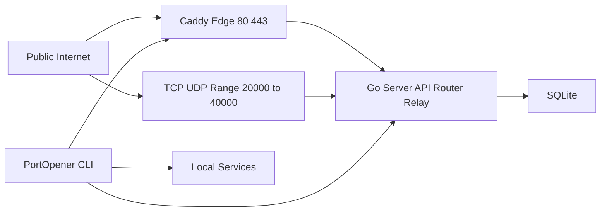

# Technical Architecture — PortOpener

Authoritative scope source: [`docs/chat.md`](../docs/chat.md)

This document proposes an implementation architecture aligned to the chosen constraints:

- Go (server + CLI)
- Caddy (edge TLS + router)
- Cloudflare DNS-01 (ACME)
- Docker Compose (VPS deployment)
- SQLite (persistence)

## System overview

## Responsibilities

### Caddy (edge)

- Terminate TLS for:
  - `admin.tunnel.<base-domain>`
  - `*.tunnel.<base-domain>`
  - custom domains (on-demand TLS)
- Route requests by Host header to the Go server
- Enforce issuance safety via `on_demand_tls` + `ask` endpoint

### Go server (single deploy)

- Control plane:
  - authenticate CLI and admin
  - manage tunnel lifecycle and reservations
  - manage custom domains and token rotation
- Data plane:
  - maintain persistent client sessions
  - multiplex logical streams for HTTP/TCP/UDP relay
- Public listeners:
  - accept TCP connections on reserved ports
  - accept UDP datagrams and relay with session mapping
- Persistence:
  - SQLite with migrations
- Observability:
  - access logs + basic metrics (with retention)
- Admin UI hosting:
  - serve static assets

### CLI

- `init <token>` stores token
- start tunnels:
  - `http <localPort> [--domain <name>] [--allow <cidr>]`
  - `tcp <localPort> [--reserve-port <externalPort>]`
  - `udp <localPort> [--reserve-port <externalPort>]`
- multiple tunnels in one process
- daemon/background mode for Windows/Linux

CLI OS targets:

- Windows
- Linux (Ubuntu/Debian compatible)

## Data plane design

### Transport

- CLI establishes a long-lived connection to the server via HTTPS (through Caddy).
- The connection is multiplexed into logical streams.

Benefits:

- supports multiple tunnels and multiple concurrent proxied connections
- avoids opening inbound ports on the client machine

### HTTP(S) and WebSockets

Request flow:

1. Public request hits `https://<subdomain>.tunnel.<base-domain>` or `https://<custom-domain>`.
2. Caddy terminates TLS and forwards to the Go router.
3. Go router resolves the tunnel session for the Host.
4. Go server forwards request over a logical stream.
5. CLI dials local service and returns response.

WebSockets:

- upgrade is forwarded as a bidirectional stream with backpressure.

### TCP

- Server binds the reserved TCP port.
- On accept, server opens a logical stream to the CLI and pipes bytes both ways.

### UDP

UDP forwarding requires explicit mapping:

- Server maintains a map keyed by remote address and tunnel.
- Datagrams are framed over the relay stream.
- Idle sessions expire to bound memory.

## Persistence

SQLite schema follows the suggestions in [`docs/chat.md`](../docs/chat.md) with recommended improvements:

- uniqueness constraints (subdomain, port reservations, custom domain)
- indexes for host and port lookups
- explicit statuses for tunnels and domain mappings
- retention cleanup jobs

## Security model

- Single-operator token authentication (stored server-side as a hash).
- Admin API/UI protected by:
  - token auth
  - admin IP allowlist
- Per-tunnel IP allowlist enforced for tunneled traffic.

### Token rotation

- UI triggers revoke+issue.
- Old token becomes invalid for new sessions; policy decides whether existing sessions are terminated.

### On-demand TLS gating

Threat: unbounded certificate issuance for attacker-chosen domains.

Mitigation:

- Caddy uses on-demand TLS, but calls Go `ask` endpoint.
- Go only returns success if the domain is explicitly present, verified, and enabled in SQLite.
- Log all `ask` decisions.

## Observability and retention

- Access logs retained 14 days.
- Metrics rollups retained 60 days (minute buckets recommended).

## VPS deployment (Docker Compose)

Recommended baseline:

- `caddy` container: ports 80/443
- `server` container: Go server
- SQLite file mounted into server container

Port range binding:

- Prefer host networking on the VPS to simplify binding large TCP/UDP ranges.

